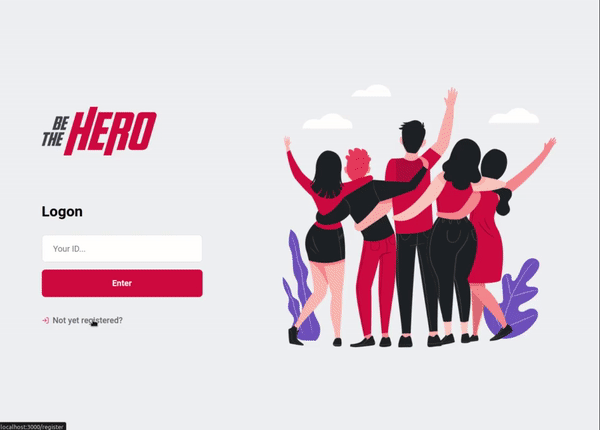

<h1 align="center">
    
</h1>

<h2 align="center">Application to connect NGOs to people who are able and want to support it.</h2>

<section align="center">
  <h4>Stack</h4>
  

    
    Node
  

  

    
    React
  

  

    
    React Native
  

<section>

  

---

## How to run

- `npm install` or `yarn install` within the folders `backend`, `frontend` and `mobile` to install the dependencies.

- `npx run knex migrate:latest` within `backend` folder and `npm start` or `yarn start` to start the backend.

- **Web:** `npm start` within `frontend` folder. Accessible from browser **http://localhost:3000**.

- **Mobile:** `npm start` within `mobile` folder. Accessible from Expo, Emulator or Physical device under **http://localhost:19002**.

###### Check within the folder `src/services/api.js` under `mobile` and `frontend` if your IP address is correct before testing.

## Demo

